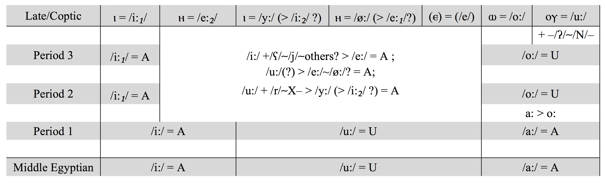
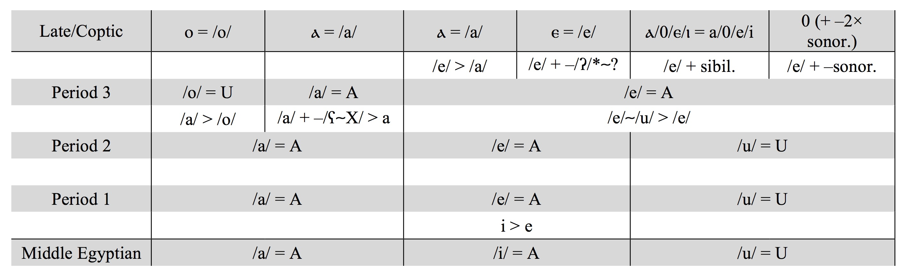

# EgyVoc : an Automatic Vocalizer for Ancient Egyptian

Version: 0.0.8

Release date: 08.01.2020

#### Authors

* **Marwan Kilani** - Swiss National Science Foundation (Mobility Grant) - Freie Universität Berlin (2019-2020)

#### How to cite

Kilani Marwan, 2019, EgyVoc 0.0.8 : an Automatic Vocalizer for Ancient Egyptian, https://github.com/MKilani/EgyVoc

## Introduction

EgyVoc uses Coptic forms and Group Writing spelling to authomatically reconstructs the Early New Kingdom vocalization of Ancient Egyptian words.

EgyVoc can reconstruct the vocalization on the basis of various combinations of data, namely:

* Sahidic form
* Sahidic form and Egyptian consonantal root (for a more accurate reconstruction of the consonants)
* Group Writing spellings (with attestations from at least one period)
* Sahidic form and Group Writing Spellings (and Egyptian consonantal root)

As a general rule, the more data are provided, the more accurate the reconstruction will be. However, in some cases a complete reconstruction can be obtained just on the basis of the Sahidic form, or of just one Group Writing spellings, while in others it iwll not be possible to obtain a full, precise reconstruction even when all the data are available. Each word is different, and each case needs to be considered individually.

The format of the input and of the output is discussed here below.

The algorithm is able to recongnize irregularities in the correspondes between the forms - in that case, an error message is output instead of the reconstruction.

The possibility to use also data from other Coptic dialects and from W-orthography spellings (see [Kilani 2017](references/bibliography.md)) will also be included in future releases.

The vocalization is reconstructed according to mainstream models (see E.g. Loprieno 1995), and the Group Writing spellings are distributed into 4 periods and they are read and analysed according to [Kilani 2019](http://widmaier-verlag.de/index.php?content=issue&isbn=978-3-943955-20-0).

The underlying phonological rules are summarised in the following tables:

Long stressed vowels:



Short stressed vowels



Notes:


Unstressed vowels are reduced to /ə/ during Period 2, or even earlier.


## Getting Started

### Prerequisites

You need Python 3.

Info how to downlaod it here:

https://realpython.com/installing-python/

### Installing

The python package can be installed through pip:

```shell
pip3 install EgyVoc==0.0.8
```

Two commands need to be called. First, one needs to initialize the FAAL aligning algorithm (for FAAL, see [Kilani 2020](references/bibliography.md) and my github repository at [FAAL](https://github.com/MKilani/FAAL)). Then EgyVoc can be called. Here a minimal working example:

```python
from EgyVoc import EgyVoc
from EgyVoc import initializeFAAL

initializeFAAL()

results = EgyVoc(SahidicWord = "ϩⲓⲃⲱⲓ", verbose = True )

print("Results as a Python Dictionary:")
print (results)
```

## Input

The algorithm can take a series of arguments as input, namely:

* SahidicForm
* EgyptianRoot
* GW_Period_1
* GW_Period_2
* GW_Period_3
* GW_Period_4
* verbose

All the arguments are optional.
The argument "verbose" is a boolean that indicates if the algorithm should output data while performing the calcualtions or not.
It can be omitted, in which case it is set by default to True.

### Input - Sahidic Form

The Sahidic Form needs to be input as a Unicode string, e.g.:

```python
SahidicForm = "ⲥⲱⲧⲙ"
```

### Input - Egyptian Root

The Egyptian Root needs to be input as a Unicode string. The unicode characters ꜣ, ꜥ, ṯ, ḏ, ḥ, ḫ, ẖ, š, q (not ḳ) must be used. 𓇋 is transliterated as j, 𓇋𓇋 as y. The character 𓏭 should not be transcribed, as it is usually a diacritic, not a consonant (see [Kilani 2019](references/bibliography.md)). In the case of late Egyptian spellings with extra final w (i.e. w-orthography spellings), the w should be ignored and not transcribed, as it does not indicate a consonant (see [Kilani 2019](references/bibliography.md)). Final consonants in weak verbs should be transcribed as j and w.

```python
EgyptianRoot = "sḏm"
```

### Input - Group Writing

Group Writing spellings should be organized chronologically according to their periods of attestations (see [Kilani 2019](references/bibliography.md)), namely:

18th dyn. - Ramses II (included) = Period 1
After Ramses II - 20th dyn (included) = Period 2
21st dyn - 22nd dyn (included) = Period 3
After 22nd dyn = Period 4

They must be input as unicode strings and transliterated according to the system suggested in [Kilani 2019](references/bibliography.md). In particular:

* Cw groups should be transliterated as CU (where C = any consonant, also below)
* Cꜣ groups should be transliterated as CA
* the sign 𓏭 should be transliterated as ʸ
* the group ​𓂓𓏤 should be transliterated as kU
* the group ​𓂧𓏭 should be transliterated as dU
* the group ​𓅓𓂝 should be transliterated as mA
* the group ​𓏭𓂋𓏤 should be transliterated as ʸr
* the group ​𓈖𓏥 should be transliterated as n-


```python
GW_Period_1 = "yA.mA"
GW_Period_2 = "yA.mA"
GW_Period_3 = "yU.mA"
GW_Period_4 = "yU.mA"
```

## Output

The Output is a Python dictionary with the following structure. If any of the main entries ('ProtoCoptic', 'GroupWriting_Voc', 'Reconstructed_Voc_Matrix', 'Reconstructed_Vocalization') is not present, it is set to None .

```python
{
	'ProtoCoptic': {
		'CopticForm': 'string', 
		'Phonemes': 'string', 
		'PhonemeClasses': 'string', 
		'Stress': 'string', 
		'VowelLength': 'string'
		'EgyptianRoot': 'string', 
		'PhonemesIPA': 'string'
	}, 
	'GroupWriting_Voc': {
		'Regular': boolean, 
		'Earlier_Cons': [list_of_strings], 
		'Reconstr_Vow': [list_of_strings], 
		'Aligned_Forms': {
			1: {
				'ID': int, 
				'Irregularities': 'string (False or True)', 
				'Form': [list_of_strings], 
				'Consonants': [list_of_strings], 
				'IPA_Cons': [list_of_strings], 
				'VocClass': [list_of_strings], 
				'VocClassEdit': [list_of_strings], 
				'VocRec': [list_of_strings], 
				'VocCat': ['#', ints , '$']
			}, 
			2: {
				'ID': int, 
				'Irregularities': 'string (False or True)', 
				'Form': [list_of_strings], 
				'Consonants': [list_of_strings], 
				'IPA_Cons': [list_of_strings], 
				'VocClass': [list_of_strings], 
				'VocClassEdit': [list_of_strings], 
				'VocRec': [list_of_strings], 
				'VocCat': ['#', ints , '$']
			}, 
			3: {
				'ID': int, 
				'Irregularities': 'string (False or True)', 
				'Form': [list_of_strings], 
				'Consonants': [list_of_strings], 
				'IPA_Cons': [list_of_strings], 
				'VocClass': [list_of_strings], 
				'VocClassEdit': [list_of_strings], 
				'VocRec': [list_of_strings], 
				'VocCat': ['#', ints , '$']
			}, 
			4: {
				'ID': int, 
				'Irregularities': 'string (False or True)', 
				'Form': [list_of_strings], 
				'Consonants': [list_of_strings], 
				'IPA_Cons': [list_of_strings], 
				'VocClass': [list_of_strings], 
				'VocClassEdit': [list_of_strings], 
				'VocRec': [list_of_strings], 
				'VocCat': ['#', ints , '$']
			}
		}, 
		'Reconstructed_Form': [list_of_strings], 
		'Phonemes': 'string', 
		'PhonemesIPA': 'string',
		'PhonemeClasses': 'string', 
		'Stress': 'string', 
		'VowelLength': 'string', 
		'Earliest_Form': 'string', 
		'PeriodEarliestForm': int
	}, 
	'Reconstructed_Voc_Matrix': {
		'Phonemes': 'string',
		'PhonemesIPA': 'string',
		'PhonemeClasses': 'string', 
		'Stress': 'string', 
		'VowelLength': 'string'
	}, 
	'Reconstructed_VocalizationIPA': 'string',
	'Reconstructed_Vocalization': 'string'
}
```

More in particular:

* **'ProtoCoptic': { }** - Reconstruction of the vocalization on the basis of the Coptic (for now only Sahidic) data.
* **'GroupWriting_Voc': { }** - Reconstruction of the vocalization on the basis of the Spellings in Group Writing.
* **'Reconstructed_Voc_Matrix': { }** - Data on the reconstruction of the vocalization combining the Coptic and Group Writing evidence.
* **'Reconstructed_Vocalization': 'string'** - Final vocalized form.
* **'Reconstructed_VocalizationIPA': 'string'** - Final vocalized form in IPA.

* **'CopticForm': 'string'** - Coptic forms used in reconstroctign the Proto-Coptic vocalization - each form is separated by a comma ,
* **'Phonemes': 'string'** - Phonemes composing the reconstructed forms - see [Sahidic Orthographic Profile](https://github.com/MKilani/Coptic_Orthographic_Profiles/tree/master/parsers/Sahidic).
* **'PhonemesIPA': 'string'** - Phonemes composing the reconstructed forms in IPA
* **'PhonemeClasses': 'string'** - Classes of the phonemes composing the reconstructed forms - see [Sahidic Orthographic Profile](https://github.com/MKilani/Coptic_Orthographic_Profiles/tree/master/parsers/Sahidic).
* **'Stress': 'string'** - Stress patterns of the reconstructed forms - see [Sahidic Orthographic Profile](https://github.com/MKilani/Coptic_Orthographic_Profiles/tree/master/parsers/Sahidic).
* **'VowelLength': 'string'** - Length of the vowels composing the reconstructed forms - see [Sahidic Orthographic Profile](https://github.com/MKilani/Coptic_Orthographic_Profiles/tree/master/parsers/Sahidic).
* **'EgyptianRoot': 'string'** - Egyptian form - consonantal root.

		
* **'Regular': boolean** - It indicates if the algorithm has identified any irregularity in the forms of the input.
* **'Earlier_Cons': [list_of_strings]** - Earlist version of the consonants that can be reconstructed on the basis of the Group Writing. spellings. List of strings where each conosnantla phoneme is an item, with '#' as first item and '$' as last item.
* **'Reconstr_Vow': [list_of_strings]** - Vowels that can be reconstructed on the basis of the Group Writing spellings - see below: Group Writing Vocalization.
* **'Aligned_Forms': { }** - Python dictionary collecting the data for the reconstructions of the Group Writing spellings for the 4 periods.
* **'ID': int** - ID of the Period of the attestation (1 = Period 1, 2 = Period 2, and so on).
* **'Irregularities': 'string (False or True)'** - It indicates if the algorithm has identified any irregularity in the forms of the input.
* **'Form': [list_of_strings]** - Form of the Group Writing spelling for the relative period.
* **'Consonants': [list_of_strings]** - Consonants of the Group Writing spelling for the relative period.
* **'IPA_Cons': [list_of_strings]** - Consonants of the Group Writing spelling for the relative period transcribed in IPA.
* **'VocClass': [list_of_strings]** - Classes of the vowels in the Group Writing spellings - see below: Group Writing Vocalization.
* **'VocClassEdit': [list_of_strings]** - Classes of the vowels in the Group Writing spellings - see below: Group Writing Vocalization.
* **'VocRec': [list_of_strings]** - Vowels reconstructed on the basis of the Group Writing spellings - see below: Group Writing Vocalization.
* **'VocCat': ['#', ints , '$']** - Organization of the vowels of the Group Writing spellings - see below: Group Writing Vocalization.
* **'Reconstructed_Form': [list_of_strings]** - Vocalizaed form reconstructed on the basis of the Group Writing spellings.
* **'Earliest_Form': 'string'**	- Earliest attested form spelled in Group Writing.
* **'PeriodEarliestForm': int**	- Period in which the earliest form is attested.
	
### Group Writing Vocalization

The following conventions are employed in the fields of the output relating to Group Writing spellings.

* ɥ = used as IPA transcription of 𓇋𓇋 = <y>, to distinguish it from 𓇋 = j 

* ā2 = vowel /ā/ next to k, may be spelled with U already in Period 1 (see [Kilani 2019](references/bibliography.md))
* a2 = vowel /a/ next to k, may be spelled with U already in Period 1 and 2 (see [Kilani 2019](references/bibliography.md))
* a3 = vowel /a/ next to ʕ and etymological pharyngeals, it does not not undergo the shift /a/ > /o/

* U = back vowel, spelled with w (see [Kilani 2019](references/bibliography.md))
* A = non-back vowel or no vowel, spelled with ꜣ or with nothing (see [Kilani 2019](references/bibliography.md))
* Ɔ = A after /k/, possibly realized as a back vowel (see [Kilani 2019](references/bibliography.md))

* [ = the vowel must be read after the associated consonant.
* ] = the vowel must be read before the associated consonant.
* \> ... < = the vowel must be read either before (marked with > ) or after (marked with < ) the associated consonants, but not in both places.

* \# = beginning of the word
* $ = end of the word
* | = phoneme separator
* ⤫ = no vowel after the associated consonant
* 0 = empty slot

* VocCat: each number indicates a distinct vowel in a given position, the first slot being after the first consonant. The presence of the same number in more than one slot indicates that the corresponding vowel may be read and either of the slots (but not in both).

## Running the tests

The file EgyVoc_tester.py provides an implementation of 4 tests generating vocalizations on the basis of different sets of data.

The file EgyVoc_tester.py can be downloaded from the github repository https://github.com/MKilani/EgyVoc/EgyVoc_tester

The file EgyVoc_tester.py can be run from command line with:

```shell
python3 EgyVoc_tester.py
```

The results should look like this:

```shell
- - - - - -
-- Test 1 --

* Transcription of the Coptic Form:

Coptic form: ϩⲓⲃⲱⲓ
Phonemes: h.j.b.ō.j
Nr of vowels: 1
Nr of consonants: 4
Phoneme classes: C.C.C.V.C
Stress: 0.0.0.S.0
Vowel Length: 0.0.0.L.0

----

* ProtoCoptic Vocalization:

CopticForm: ϩⲓⲃⲱⲓ
EgyptianRoot: None

Reconstruction - PhonemesIPA: h.ə.j.b.ā.j.ə
Reconstruction - Phonemes: h.ə.j.b.ā.j.ə
Reconstruction - Phoneme classes: C.V.C.C.V.C.V
Reconstruction - Stress: 0.U.0.0.S.0.U
Reconstruction - Vowel Length: 0.u.0.0.L.0.u

----

Results as a Python Dictionary:
{'ProtoCoptic': {'CopticForm': 'ϩⲓⲃⲱⲓ', 'Phonemes': 'h.ə.j.b.ā.j.ə', 'PhonemeClasses': 'C.V.C.C.V.C.V', 'Stress': '0.U.0.0.S.0.U', 'VowelLength': '0.u.0.0.L.0.u', 'EgyptianRoot': 'None', 'PhonemesIPA': 'h.ə.j.b.ā.j.ə'}, 'GroupWriting_Voc': None, 'Reconstructed_Voc_Matrix': None, 'Reconstructed_Vocalization': None}

- - - - - -
-- Test 2 --

* Transcription of the Coptic Form:

Coptic form: ⲥⲱⲧⲙ
Phonemes: s.ō.t.m
Nr of vowels: 1
Nr of consonants: 3
Phoneme classes: C.V.C.C
Stress: 0.S.0.0
Vowel Length: 0.L.0.0

----

* ProtoCoptic Vocalization:

CopticForm: ⲥⲱⲧⲙ
EgyptianRoot: sḏm

Reconstruction - PhonemesIPA: s.ā.ɟ.ə.m
Reconstruction - Phonemes: s.ā.ḏ.ə.m
Reconstruction - Phoneme classes: C.V.C.V.C
Reconstruction - Stress: 0.S.0.U.0
Reconstruction - Vowel Length: 0.L.0.u.0

----

Results as a Python Dictionary:
{'ProtoCoptic': {'CopticForm': 'ⲥⲱⲧⲙ', 'EgyptianRoot': 'sḏm', 'PhonemesIPA': 's.ā.ɟ.ə.m', 'PhonemeClasses': 'C.V.C.V.C', 'Stress': '0.S.0.U.0', 'VowelLength': '0.L.0.u.0', 'Phonemes': 's.ā.ḏ.ə.m'}, 'GroupWriting_Voc': None, 'Reconstructed_Voc_Matrix': None, 'Reconstructed_Vocalization': None}

- - - - - -
-- Test 3 --

* GroupWriting vocalization:

Regular: False
First attestation: yA.mA
First attestation: Period 1

Reconstruction - PhonemesIPA: £
Reconstruction - Phonemes: £
Reconstruction - Phon. Classes: £
Reconstruction - Stress: £
Reconstruction - Vowel Length: £

----

Results as a Python Dictionary:
{'ProtoCoptic': None, 'GroupWriting_Voc': {'Regular': False, 'Earlier_Cons': ['#', 'ɥ', 'm', '$'], 'Reconstr_Vow': ['#', '|irregularity', '|⤫'], 'Aligned_Forms': {1: {'ID': 1, 'Irregularities': 'False', 'Form': ['#', 'yA', 'mA', '$'], 'Consonants': ['#', 'y', 'm', '$'], 'IPA_Cons': ['#', 'ɥ', 'm', '$'], 'VocClass': ['#', 'A', 'A', '$'], 'VocClassEdit': ['#', '[A', 'A', '$'], 'VocRec': ['#', '|[|a|ā|i|ī|0', '|a|ā|i|ī|0', '$'], 'VocCat': ['#', 0, 1, '$']}, 2: {'ID': 2, 'Irregularities': 'False', 'Form': ['#', 'yA', 'mA', '$'], 'Consonants': ['#', 'y', 'm', '$'], 'IPA_Cons': ['#', 'ɥ', 'm', '$'], 'VocClass': ['#', 'A', 'A', '$'], 'VocClassEdit': ['#', '[A', 'A', '$'], 'VocRec': ['#', '|[|a|i|ī|0', '|a|i|ī|0', '$'], 'VocCat': ['#', 0, 1, '$']}, 3: {'ID': 3, 'Irregularities': 'False', 'Form': ['#', 'yU', 'mA', '$'], 'Consonants': ['#', 'y', 'm', '$'], 'IPA_Cons': ['#', 'ɥ', 'm', '$'], 'VocClass': ['#', 'U', 'A', '$'], 'VocClassEdit': ['#', '[U', 'A', '$'], 'VocRec': ['#', '|[|ū|ō|o', '|a|e|ī|0', '$'], 'VocCat': ['#', 0, 1, '$']}, 4: {'ID': 4, 'Irregularities': 'False', 'Form': ['#', 'yU', 'mA', '$'], 'Consonants': ['#', 'y', 'm', '$'], 'IPA_Cons': ['#', 'ɥ', 'm', '$'], 'VocClass': ['#', 'U', 'A', '$'], 'VocClassEdit': ['#', '[U', 'A', '$'], 'VocRec': ['#', '|[|ō|o', '|a|e|ī|ē|0', '$'], 'VocCat': ['#', 0, 1, '$']}}, 'Reconstructed_Form': ['$'], 'Phonemes': '£', 'PhonemesIPA': '£', 'PhonemeClasses': '£', 'Stress': '£', 'VowelLength': '£', 'Earliest_Form': 'yA.mA', 'PeriodEarliestForm': 1}, 'Reconstructed_Voc_Matrix': None, 'Reconstructed_Vocalization': None}

- - - - - -
-- Test 4 --

* Transcription of the Coptic Form:

Coptic form: ϫⲁϫ
Phonemes: c.a.c
Nr of vowels: 1
Nr of consonants: 2
Phoneme classes: C.V.C
Stress: 0.S.0
Vowel Length: 0.S.0

----

* ProtoCoptic Vocalization:

CopticForm: ϫⲁϫ
EgyptianRoot: None

Reconstruction - PhonemesIPA: c.i|u.c
Reconstruction - Phonemes: c.i|u.c
Reconstruction - Phoneme classes: C.V.C
Reconstruction - Stress: 0.S.0
Reconstruction - Vowel Length: 0.S.0

----

* GroupWriting vocalization:

Regular: True
First attestation: ṯU.ṯU
First attestation: Period 2

Reconstruction - PhonemesIPA: c.u.c
Reconstruction - Phonemes: ṯ.u.ṯ
Reconstruction - Phon. Classes: C.V.C
Reconstruction - Stress: 0.S.0
Reconstruction - Vowel Length: 0.S.0

----

* Joined reconstructed vocalization:

Reconstructed vocalizationIPA: cuc
Reconstructed vocalization: ṯuṯ

Reconstruction - PhonemesIPA: c.u.c
Reconstruction - Phonemes: ṯ.u.ṯ
Reconstruction - Phon. Classes: C.u.C
Reconstruction - Stress: 0.u.0
Reconstruction - Vowel Length: 0.u.0

----

Results as a Python Dictionary:
{'ProtoCoptic': {'CopticForm': 'ϫⲁϫ', 'Phonemes': 'c.i|u.c', 'PhonemeClasses': 'C.V.C', 'Stress': '0.S.0', 'VowelLength': '0.S.0', 'EgyptianRoot': 'None', 'PhonemesIPA': 'c.i|u.c'}, 'GroupWriting_Voc': {'Regular': True, 'Earlier_Cons': ['#', 'c', 'c', '$'], 'Reconstr_Vow': ['#', '|u', '|⤫'], 'Aligned_Forms': {1: {'ID': 1, 'Irregularities': 'True', 'Form': ['#', '∅', '∅', '$'], 'Consonants': ['#', '∅', '∅', '$'], 'IPA_Cons': ['#', '∅', '∅', '$'], 'VocClass': ['#', '∅', '∅', '$'], 'VocClassEdit': ['#', '∅', '∅', '$'], 'VocRec': ['#', '∅', '∅', '$'], 'VocCat': ['#', '∅', '∅', '$']}, 2: {'ID': 2, 'Irregularities': 'False', 'Form': ['#', 'ṯU', 'ṯU', '$'], 'Consonants': ['#', 'ṯ', 'ṯ', '$'], 'IPA_Cons': ['#', 'c', 'c', '$'], 'VocClass': ['#', 'U', 'U', '$'], 'VocClassEdit': ['#', 'U]', ']U', '$'], 'VocRec': ['#', '|[|u|ū|ō', '|]|u|ū|ō', '$'], 'VocCat': ['#', 0, 1, '$']}, 3: {'ID': 3, 'Irregularities': 'False', 'Form': ['#', 'ṯA', 'ṯA', '$'], 'Consonants': ['#', 'ṯ', 'ṯ', '$'], 'IPA_Cons': ['#', 'c', 'c', '$'], 'VocClass': ['#', 'A', 'A', '$'], 'VocClassEdit': ['#', '[A', 'A', '$'], 'VocRec': ['#', '|[|a|e|ī|0', '|a|e|ī|0', '$'], 'VocCat': ['#', 0, 1, '$']}, 4: {'ID': 4, 'Irregularities': 'True', 'Form': ['#', '∅', '∅', '$'], 'Consonants': ['#', '∅', '∅', '$'], 'IPA_Cons': ['#', '∅', '∅', '$'], 'VocClass': ['#', '∅', '∅', '$'], 'VocClassEdit': ['#', '∅', '∅', '$'], 'VocRec': ['#', '∅', '∅', '$'], 'VocCat': ['#', '∅', '∅', '$']}}, 'Reconstructed_Form': ['#', 'c', '|u', 'c', '|⤫', '$'], 'Phonemes': 'ṯ.u.ṯ', 'PhonemesIPA': 'c.u.c', 'PhonemeClasses': 'C.V.C', 'Stress': '0.S.0', 'VowelLength': '0.S.0', 'Earliest_Form': 'ṯU.ṯU', 'PeriodEarliestForm': 2}, 'Reconstructed_Voc_Matrix': {'Phonemes': 'ṯ.u.ṯ', 'PhonemesIPA': 'c.u.c', 'PhonemeClasses': 'C.u.C', 'Stress': '0.u.0', 'VowelLength': '0.u.0'}, 'Reconstructed_VocalizationIPA': 'cuc', 'Reconstructed_Vocalization': 'ṯuṯ'}
```